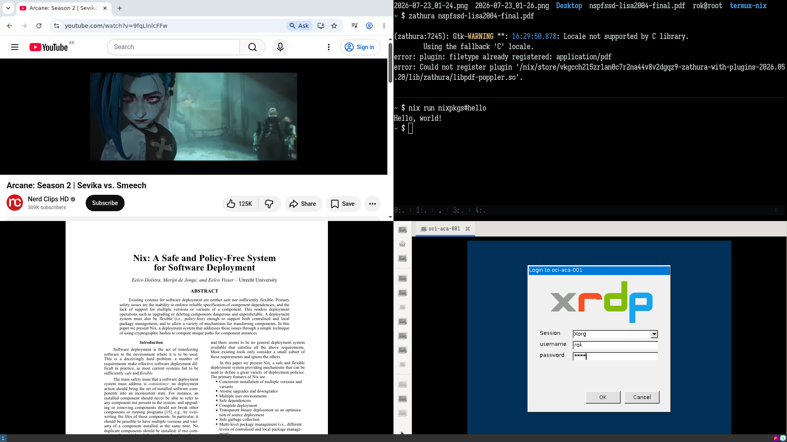

# termux-nix

Manage termux/termux-x11 desktop with nix.



Galaxy S25. i3 desktop running chrome/lxterminal from termux pkgs, remmina, zathura from nixpkgs.

- Declarative nix config for termux packages/services, apps from nixpkgs, and dotfiles.
- Native termux packages/services managed in nix.
    - No proot, browser can play video.
- Nix apps running in a proot container.
    - Able to run any apps from nixpkgs. remmina, zathura, claude-code configured in pkgs/nix-apps.nix.
- **Fork and build your own system.**
- i3/lxqt desktop by default. Bring your own desktop if you want.

**This is not nix-on-droid.** Instead, it's native termux (no-root) with poor, vibe-coded scripts to manage termux desktop with nix.
It builds the aarch64 nix generation on a PC and pushes(rsync) it to the device, so the device don't crash while building nixpkgs.

At least it works great for me. This has been actual replacement for my laptop. 

Nix is required but I don't think you have to learn full nix to use this. It's fairly simple.


## Requirements

- **Android**: 
    - android device (no-root required)
    - [termux](https://f-droid.org/ko/packages/com.termux/) : tested on latest beta release
    - [termux-x11](https://github.com/termux/termux-x11/releases/tag/nightly)
- **PC**: Any computer with nix (`extra-platforms = aarch64-linux` + qemu-binfmt)
    - Builds android aarch64 nix generations and pushes(rsync) them to the device.
- tailscale: on both android/pc. Not required, but recommended for easy ssh.
    - tailscale DNS server (100.100.100.100) is hardcoded, delete if you don't use tailscale.

## Usage 

Everything is driven from the PC through a script `./termux-nix`:

```sh
./termux-nix switch <host>   # build → push → activate (<host> device, default: termux)
```


What `switch` does: 
- rsync the repo to the device, auto-bootstrap the nix container if missing
- build the aarch64 generation on the PC
- push the closure into the container store via **native rsync** (no proot)
- light DB registration → materialize as a symlink farm (no copying) 
- install the termux pkgs

## Setup

termux must be reachable from the PC with ssh.

### termux
```
pkg install openssh -y
sshd

# use your own public key
curl https://github.com/aca.keys > ~/.ssh/authorized_keys
sshd
```

### PC
```sh
git clone https://github.com/aca/termux-nix && cd termux-nix
# customize as you want
./termux-nix switch <android-host>
```

### termux
And start the desktop on the termux, it will automatically start termux x11 apps:

i3 
```
start-desktop-i3
# win+enter to start rofi app launcher
```

lxqt
```
start-desktop-lxqt
```

quit
```
stop-desktop
```

### Customization

- termux native packages: the `packages` list in `pkgs/termux.nix`
- nix apps as termux commands: the `apps` list in `pkgs/nix-apps.nix`
- termux runit services ($PREFIX/var/service): the `services` set in `pkgs/services.nix`
- configurations: `pkgs/*.nix` (i3, konsole, lxterminal, shell, ...)

```sh
./termux-nix switch     # edit → switch, that's all
```


## Nix CLI (on the device)

The `nix`/`nix-shell`/`nix-build`/`nix-env` forwarders pass through to the container
transparently. They use `proot-distro login`, so you get the full container
environment, and the termux cwd is preserved.

I was able to run GUI programs. But not tested enough to be sure for other programs.

```sh
nix run nixpkgs#remmina
```
